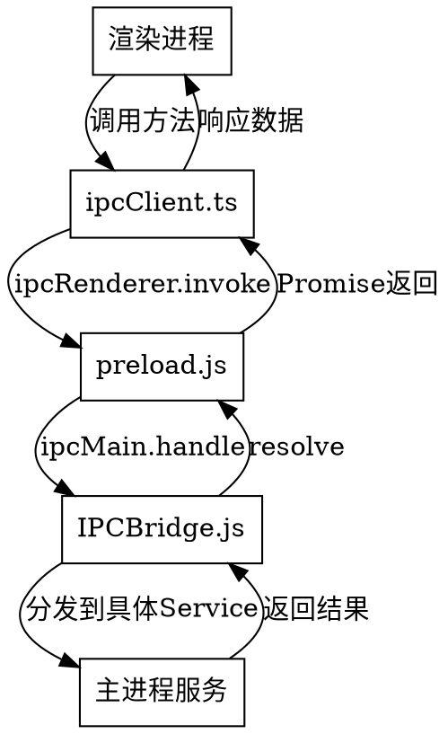

# Boost Tools - 效能助推器 产品设计文档

> 创建日期：2026-03-31

## 一、产品概述

### 1.1 产品定位
Boost Tools 是一款本地化的提效工具集，通过系统托盘+快捷键唤起的方式，为用户提供快速便捷的日常办公辅助功能。

### 1.2 目标用户
需要频繁处理文档、生成代码表达式、管理待办事项、管理账号密码的开发者和办公人员。

### 1.3 核心价值
- **快速唤起**：系统托盘常驻，快捷键一键呼出，不打断工作流
- **本地存储**：数据完全本地化，用户可控是否同步GitHub
- **AI辅助**：集成大语言模型能力，智能生成周报、解读文档、生成假数据
- **工具集成**：15个常用工具一站式解决，无需切换多个应用

---

## 二、技术架构

### 2.1 技术选型
- **桌面框架**：Electron（跨平台，生态成熟）
- **前端框架**：React + TypeScript
- **UI组件库**：Ant Design（完善的表单、表格、输入组件）
- **数据存储**：JSON文件存储（便于Git同步和用户查看）
- **节假日数据**：holiday-cn子模块（已集成）

### 2.2 项目结构
```
boost-tools/
├── package.json
├── electron/                  # Electron主进程
│   ├── main.js               # 主入口：系统托盘、快捷键、窗口管理
│   ├── preload.js            # 预加载脚本：IPC通信桥梁
│   └── services/
│       ├── llm-service.js    # 大模型调用服务（多格式兼容）
│       ├── holiday-service.js # 节假日判断（读取holiday-cn）
│       ├── store-service.js  # JSON文件存储服务
│       └── scheduler.js      # 定时任务（周五周报）
│
├── src/                       # React渲染进程
│   ├── App.tsx               # 主应用：分组导航
│   ├── components/           # 共用组件
│   ├── views/                # 各功能页面
│   │   ├── ai/               # AI辅助组（4个功能）
│   │   ├── expression/       # 表达式生成组（3个功能）
│   │   ├── format/           # 格式化组（3个功能）
│   │   ├── tools/            # 工具组（3个功能）
│   │   └── data/             # 数据管理组（2个功能）
│   └── hooks/                # React hooks
│
├── data/                      # 用户数据目录（JSON文件）
│   ├── config.json           # 全局配置（快捷键、LLM API设置）
│   ├── todos.json            # TodoList数据
│   ├── notes.json            # 笔记数据
│   ├── passwords.json        # 账号密码数据
│   ├── prompts.json          # 提示词模板
│   └── weekly-reports.json   # 历史周报记录
│
└── holiday-cn/                # 节假日子模块（已存在）
```

### 2.3 核心流程
1. 用户按下快捷键 → 主进程创建/显示窗口
2. 窗口渲染分组视图 → 用户选择功能模块
3. 功能模块调用IPC → 主进程处理（LLM调用、文件读写、定时任务）
4. 结果返回渲染进程 → 显示结果

---

## 三、功能模块设计

### 3.1 功能分组概览

| 分组 | 功能数量 | 功能列表 |
|------|----------|----------|
| AI辅助组 | 4 | TodoList周报、文件解读、假数据生成、提示词模板 |
| 表达式生成组 | 3 | Aviator表达式、Cron表达式、正则表达式 |
| 格式化组 | 3 | JSON美化、XML美化、文本比较 |
| 工具组 | 3 | UUID生成、加密工具、数据填充模板 |
| 数据管理组 | 2 | 笔记、账号密码 |

---

### 3.2 AI辅助组

#### 3.2.1 TodoList + 周报自动生成

**数据结构**（todos.json）：
```json
{
  "todos": [
    {
      "id": "uuid",
      "title": "任务标题",
      "status": "pending|completed",
      "dueDate": "2026-04-01",
      "group": "today|tomorrow|nextWeek",
      "createTime": "2026-03-31T10:00:00",
      "completeTime": null
    }
  ]
}
```

**功能要点**：
- 三栏视图：今日待办、明日待办、下周计划
- 支持拖拽调整分组
- 任务状态切换（待办→完成）
- 周报自动生成逻辑：
  - 默认周五17:00触发
  - 检查holiday-cn判断周五是否放假：若放假则周四发，若周六补班则周六发
  - 汇报周一至触发时间点已完成的任务
- 周报手动触发：用户点击按钮即时生成
- 周报格式：纯文本或Markdown，用户可选

**周报输出示例**：
```markdown
## 本周工作总结（2026-03-31）

### 已完成任务
- [2026-03-25] 完成项目文档编写
- [2026-03-26] 修复登录模块Bug
- [2026-03-27] 部署测试环境
- [2026-03-28] 代码评审

### 统计
本周共完成 4 项任务
```

#### 3.2.2 文件解读成重点

**功能要点**：
- 支持上传Word/PDF文件，限制≤50MB
- 提取文档文本内容
- 调用LLM API解析，要求输出精简重点
- 每条重点标注来源位置（页码、章节等）
- 结果可复制

**输出示例**：
```
【重点1】项目核心目标是提升用户转化率（来源：第2章第1节）

【重点2】技术架构采用微服务设计（来源：第3章，页码12）

【重点3】上线时间计划为2026年Q2（来源：第5章第3节）
```

#### 3.2.3 假数据生成

**功能要点**：
- 输入字段名和值描述（如"姓名: 中文姓名"、"年龄: 18-60岁随机整数"）
- 选择生成条数
- 选择输出格式：JSON或表格（制表符分隔）
- 调用LLM根据描述生成假数据
- 一键复制结果

#### 3.2.4 常用提示词模板

**数据结构**（prompts.json）：
```json
{
  "prompts": [
    {
      "id": "uuid",
      "name": "代码解释",
      "template": "请解释以下{{language}}代码的功能：\n{{code}}",
      "placeholders": [
        {"name": "language", "description": "编程语言"},
        {"name": "code", "description": "待解释的代码"}
      ]
    }
  ]
}
```

**功能要点**：
- 占位符语法：`{{字段名}}`
- 选择模板 → 弹出表单填充各占位符 → 自动替换生成完整提示词
- 一键复制使用
- 支持新建、编辑、删除模板

---

### 3.3 表达式生成组

#### 3.3.1 Aviator表达式生成器

**运算符面板**（参考aviator.md）：
- 比较运算符：`>` `>=` `<` `<=` `==` `!=` `=~`
- 逻辑运算符：`&&` `||` `!`
- 算术运算符：`+` `-` `*` `/` `%`
- 括号：`( )`
- 常用函数：`string.contains`、`string.length`、`seq.gt`、`seq.include`等

**功能要点**：
- 左侧：字段列表（可添加字段名和值）
- 右侧：运算符/函数按钮面板
- 点击拼接表达式，实时显示
- 一键复制

**示例输出**：
- `age > 18 && status == 'active'`
- `string.contains(name, 'test')`
- `seq.include(list, 'item')`

#### 3.3.2 Cron表达式生成器

**功能要点**：
- 五个下拉选择框：秒、分、时、日、月、周
- 常用预设快捷按钮：
  - 每分钟、每小时、每天9点
  - 每周一9点、每月1号
  - 工作日（周一至周五）
- 生成表达式并显示含义说明
- 一键复制

#### 3.3.3 正则表达式生成器

**预设列表**：
| 预设名称 | 正则表达式 |
|----------|------------|
| 匹配中文字符 | `[\u4e00-\u9fa5]` |
| 匹配双字节字符 | `[^\x00-\xff]` |
| 匹配空白行 | `\n\s*\r` |
| 匹配Email地址 | `\w+([-+.]\w+)*@\w+([-.]\w+)*\.\w+([-.]\w+)*` |
| 匹配网址URL | `[a-zA-z]+://[^\s]*` |
| 匹配国内电话号码 | `\d{3}-\d{8}|\d{4}-\d{7}` |
| 匹配腾讯QQ号 | `[1-9][0-9]{4,}` |
| 匹配中国邮政编码 | `[1-9]\d{5}(?!\d)` |
| 匹配18位身份证号 | `\d{17}[\d|x|X]` |
| 匹配日期格式(年-月-日) | `\d{4}-\d{1,2}-\d{1,2}` |
| 匹配正整数 | `[1-9]\d*` |
| 匹配负整数 | `-[1-9]\d*` |
| 匹配整数 | `-?[1-9]\d*` |
| 匹配非负整数 | `[1-9]\d*|0` |
| 匹配非正整数 | `-[1-9]\d*|0` |
| 匹配正浮点数 | `[1-9]\d*\.\d*|0\.\d*[1-9]\d*` |
| 匹配负浮点数 | `-[1-9]\d*\.\d*|-0\.\d*[1-9]\d*` |

**功能要点**：
- 点击预设即生成对应正则
- 可选测试输入框验证匹配效果
- 一键复制

---

### 3.4 格式化组

#### 3.4.1 JSON美化格式化工具

**功能要点**：
- 输入JSON文本
- 格式化：可选缩进（2空格/4空格/Tab）
- 压缩：移除空白，最小化输出
- 校验：检测语法错误，提示错误位置
- 一键复制

#### 3.4.2 XML美化格式化工具

**功能要点**：
- 输入XML文本
- 格式化：可选缩进方式
- 压缩：移除空白，最小化输出
- 校验：检测语法错误
- 一键复制

#### 3.4.3 文本比较

**功能要点**：
- 左右两个文本框输入
- 逐行对比，高亮显示差异：
  - 新增行：绿色
  - 删除行：红色
  - 修改行：黄色
- 支持同步滚动

---

### 3.5 工具组

#### 3.5.1 UUID生成器

**功能要点**：
- 输入生成条数（默认1）
- 配置选项：
  - 大写/小写（默认小写）
  - 保留横线/去掉横线（默认保留）
- 批量生成UUID列表
- 一键复制（单条或全部）

#### 3.5.2 加密工具

**支持算法**：MD5、SHA-1、SHA-256、SHA-512

**功能要点**：
- 输入待加密文本
- 同时显示所有算法结果
- 一键复制
- 可选：文件上传计算文件哈希

#### 3.5.3 数据填充模板

**转换模式**：
| 模式 | 输入示例 | 输出示例 |
|------|----------|----------|
| SQL IN格式 | 张三<br>李四<br>王五 | `'张三','李四','王五'` |
| 竖向变横向 | 张三<br>李四<br>王五 | `张三\t李四\t王五`（制表符分隔） |
| 横向变竖向 | 张三\t李四\t王五 | 张三<br>李四<br>王五 |
| 添加前缀/后缀 | 张三<br>李四 | `前缀_张三_后缀`<br>`前缀_李四_后缀` |
| 编号添加 | 张三<br>李四 | `1. 张三`<br>`2. 李四` |

**功能要点**：
- 原始数据文本框输入
- 选择转换模式
- 一键复制结果

---

### 3.6 数据管理组

#### 3.6.1 笔记

**数据结构**（notes.json）：
```json
{
  "notes": [
    {
      "id": "uuid",
      "title": "笔记标题",
      "content": "笔记内容",
      "format": "text|markdown",
      "createTime": "2026-03-31T10:00:00",
      "updateTime": "2026-03-31T12:00:00"
    }
  ]
}
```

**功能要点**：
- 左侧笔记列表，右侧编辑区
- 支持纯文本和Markdown两种模式切换
- Markdown模式提供语法提示和预览
- 搜索功能（按标题或内容）
- 新建、编辑、删除

#### 3.6.2 账号密码管理

**数据结构**（passwords.json）：
```json
{
  "passwords": [
    {
      "id": "uuid",
      "name": "账号名称",
      "account": "登录账号",
      "password": "密码",
      "url": "对应地址",
      "remark": "备注",
      "createTime": "2026-03-31T10:00:00"
    }
  ]
}
```

**功能要点**：
- 列表显示名称、地址、备注
- 点击展开详情显示账号、密码
- 密码默认隐藏，一键复制
- 搜索功能
- 新建、编辑、删除

---

## 四、界面交互设计

### 4.1 主界面布局

```
┌─────────────────────────────────────────────────────┐
│  ┌─────┬───────────────────────────────────────────┐│
│  │ AI  │                                           ││
│  │ 🤖  │   ┌─────────┐ ┌─────────┐ ┌─────────┐    ││
│  ├─────┤   │TodoList │ │文件解读 │ │假数据   │    ││
│  │ 表  │   │+周报    │ │         │ │生成     │    ││
│  │ 达  │   └─────────┘ └─────────┘ └─────────┘    ││
│  │ 式  │                                           ││
│  │ ⚙️  │   ┌─────────┐                            ││
│  ├─────┤   │提示词   │                            ││
│  │ 格  │   │模板     │                            ││
│  │ 式  │   └─────────┘                            ││
│  │ 📝  │                                           ││
│  ├─────┤                                           ││
│  │ 工  │                                           ││
│  │ 具  │                                           ││
│  │ 🔧  │                                           ││
│  ├─────┤                                           ││
│  │ 数  │                                           ││
│  │ 据  │                                           ││
│  │ 📁  │                                           ││
│  └─────┤                                           ││
│        │                                           ││
│  设置  │                                           ││
│  ⚙️    │                                           ││
│  └─────┴───────────────────────────────────────────┘│
└─────────────────────────────────────────────────────┘
```

**布局说明**：
- 左侧边栏：分组图标导航（5个分组 + 设置入口）
- 右侧内容区：当前分组的功能卡片列表
- 点击功能卡片进入具体功能页面

### 4.2 系统托盘

**托盘图标**：应用Logo

**右键菜单**：
- 显示主窗口
- 设置
- 退出

**点击行为**：显示/隐藏主窗口

### 4.3 窗口属性

- 默认尺寸：800x600
- 可调整大小
- 最小化到托盘（不关闭）
- 关闭时提示是否退出

### 4.4 快捷键

- 用户自定义全局热键唤起窗口
- 首次使用需设置快捷键
- 默认无快捷键，引导用户设置

---

## 五、全局配置设计

### 5.1 大模型设置

**配置项**：
- API地址输入框
- API Key输入框
- API格式选择：OpenAI、Claude、文心一言等
- 模型选择下拉框
- 连接测试按钮

**数据结构**（config.json）：
```json
{
  "llm": {
    "apiUrl": "https://api.openai.com/v1",
    "apiKey": "sk-xxx",
    "format": "openai",
    "model": "gpt-4"
  }
}
```

### 5.2 快捷键设置

- 输入框捕获按键组合
- 保存到config.json

### 5.3 周报设置

- 自动生成开关
- 生成时间设置（默认周五17:00）
- 周报格式选择（纯文本/Markdown）

---

## 六、服务架构设计

### 6.1 主进程服务模块

| 服务名称 | 文件路径 | 功能描述 |
|----------|----------|----------|
| TrayService | `electron/services/TrayService.js` | 系统托盘管理：图标、右键菜单、点击事件 |
| ShortcutService | `electron/services/ShortcutService.js` | 全局快捷键注册与监听 |
| StoreService | `electron/services/StoreService.js` | JSON文件读写：config、todos、notes等 |
| LLMService | `electron/services/LLMService.js` | 大模型API调用（Anthropic Messages格式） |
| HolidayService | `electron/services/HolidayService.js` | 节假日判断：读取holiday-cn子模块数据 |
| SchedulerService | `electron/services/SchedulerService.js` | 定时任务：周报自动生成、每日任务迁移 |
| FileService | `electron/services/FileService.js` | 文件处理：上传、文本提取（Word/PDF） |
| IPCBridge | `electron/services/IPCBridge.js` | IPC通道统一管理：注册、分发、响应 |

### 6.2 渲染进程服务模块

| 服务名称 | 文件路径 | 功能描述 |
|----------|----------|----------|
| ipcClient | `src/services/ipcClient.ts` | IPC客户端封装：统一调用主进程接口 |
| clipboardService | `src/services/clipboardService.ts` | 剪贴板操作：复制文本、读取内容 |
| storageService | `src/services/storageService.ts` | 前端临时存储：状态缓存、会话数据 |

---

## 七、IPC接口设计

### 7.1 IPC通道定义

采用 `{模块}:{操作}` 格式命名通道：

| 模块 | 通道名称 | 操作类型 | 参数 | 返回值 |
|------|----------|----------|------|--------|
| system | `system:getVersion` | invoke | 无 | `{version: string}` |
| system | `system:quit` | send | 无 | 无 |
| config | `config:get` | invoke | 无 | `AppConfig` |
| config | `config:set` | invoke | `AppConfig` | `{success: boolean}` |
| todos | `todos:getAll` | invoke | 无 | `TodoData` |
| todos | `todos:add` | invoke | `TodoItem` | `{success, id}` |
| todos | `todos:update` | invoke | `{id, data}` | `{success}` |
| todos | `todos:delete` | invoke | `id` | `{success}` |
| todos | `todos:migrate` | invoke | 无 | `{success, migratedCount}` |
| file | `file:upload` | invoke | `{path, type}` | `{content: string}` |
| file | `file:extractText` | invoke | `{path}` | `{text: string}` |
| prompts | `prompts:getAll` | invoke | 无 | `PromptsData` |
| prompts | `prompts:add` | invoke | `PromptItem` | `{success, id}` |
| prompts | `prompts:update` | invoke | `{id, data}` | `{success}` |
| prompts | `prompts:delete` | invoke | `id` | `{success}` |
| notes | `notes:getAll` | invoke | 无 | `NotesData` |
| notes | `notes:add` | invoke | `NoteItem` | `{success, id}` |
| notes | `notes:update` | invoke | `{id, data}` | `{success}` |
| notes | `notes:delete` | invoke | `id` | `{success}` |
| passwords | `passwords:getAll` | invoke | 无 | `PasswordsData` |
| passwords | `passwords:add` | invoke | `PasswordItem` | `{success, id}` |
| passwords | `passwords:update` | invoke | `{id, data}` | `{success}` |
| passwords | `passwords:delete` | invoke | `id` | `{success}` |
| holiday | `holiday:isHoliday` | invoke | `date` | `{isHoliday: boolean, name?: string}` |
| holiday | `holiday:getNextWorkday` | invoke | `date` | `{date: string}` |
| shortcut | `shortcut:register` | invoke | `{key: string}` | `{success}` |
| shortcut | `shortcut:unregister` | invoke | 无 | `{success}` |
| scheduler | `scheduler:setWeeklyReport` | invoke | `{enabled, time}` | `{success}` |
| llm | `llm:call` | invoke | `{prompt, options}` | `LLMResponse` |
| llm | `llm:testConnection` | invoke | 无 | `{success, error?: string}` |
| llm | `llm:summarizeFile` | invoke | `{content, type}` | `{points: string[]}` |
| llm | `llm:generateFakeData` | invoke | `{fields, count, format}` | `{data: string}` |
| llm | `llm:generateWeeklyReport` | invoke | `{todos}` | `{report: string}` |

### 7.2 IPC响应格式规范

```typescript
// IPCResponse<T> - 统一响应格式
interface IPCResponse<T> {
  success: boolean;
  data?: T;
  error?: {
    code: string;
    message: string;
  };
}

// 示例：成功响应
{ success: true, data: { id: "uuid-xxx" } }

// 示例：失败响应
{ success: false, error: { code: "STORE_READ_ERROR", message: "文件读取失败" } }
```

### 7.3 IPC通信机制



---

## 八、LLM API设计

### 8.1 API调用规范

采用 **Anthropic Messages原生格式**：

```typescript
// LLMService.js - 大模型调用服务
class LLMService {
  constructor(config: LLMConfig) {
    this.apiUrl = config.apiUrl;      // 用户配置的API地址
    this.apiKey = config.apiKey;      // 用户配置的API Key
    this.model = config.model;        // 用户手动输入的模型名
  }

  // 通用调用方法
  async call(prompt: string, options?: LLMOptions): Promise<LLMResponse> {
    const response = await fetch(`${this.apiUrl}/v1/messages`, {
      method: 'POST',
      headers: {
        'Content-Type': 'application/json',
        'x-api-key': this.apiKey,
        'anthropic-version': '2023-06-01'
      },
      body: JSON.stringify({
        model: this.model,
        max_tokens: options?.maxTokens || 4096,
        messages: [{ role: 'user', content: prompt }]
      })
    });
    return this.parseResponse(response);
  }

  // 文件解读专用
  async summarizeFile(content: string, fileType: string): Promise<string[]> {
    const prompt = `请从以下${fileType}文档中提取关键重点，每条重点需标注来源位置。
输出格式：【重点N】内容描述（来源：章节/页码）

---
${content}`;
    const res = await this.call(prompt);
    return this.extractPoints(res.content);
  }

  // 假数据生成专用
  async generateFakeData(fields: FieldDef[], count: number, format: string): Promise<string> {
    const prompt = `请生成${count}条测试数据，字段如下：
${fields.map(f => `- ${f.name}: ${f.description}`).join('\n')}
输出格式：${format}（制表符分隔请用真实Tab字符）`;
    const res = await this.call(prompt);
    return res.content;
  }

  // 周报生成专用
  async generateWeeklyReport(completedTodos: TodoItem[]): Promise<string> {
    const prompt = `请根据以下本周已完成的任务，生成一份周报摘要：
${completedTodos.map(t => `- [${t.completeTime}] ${t.title}`).join('\n')}
要求：简洁、突出成果、可复制使用，Markdown格式。`;
    const res = await this.call(prompt);
    return res.content;
  }

  // 连接测试
  async testConnection(): Promise<{success: boolean, error?: string}> {
    try {
      await this.call('Hello', { maxTokens: 10 });
      return { success: true };
    } catch (e) {
      return { success: false, error: e.message };
    }
  }
}

// 类型定义
interface LLMConfig {
  apiUrl: string;
  apiKey: string;
  model: string;
}

interface LLMOptions {
  maxTokens?: number;
}

interface LLMResponse {
  content: string;
  usage?: { inputTokens: number; outputTokens: number };
}
```

### 8.2 LLM配置数据结构

```json
// config.json - llm配置部分
{
  "llm": {
    "apiUrl": "https://api.anthropic.com",
    "apiKey": "sk-ant-xxx",
    "model": "claude-sonnet-4-6"
  }
}
```

**配置说明**：
- API地址：用户手动填写（支持自定义endpoint）
- API Key：密码输入框，不明文显示
- 模型名称：手动输入框（非下拉选择，用户已确认）

---

## 九、React组件设计

### 9.1 全局布局组件

```
src/components/Layout/
├── MainLayout.tsx         # 主布局（左侧导航 + 右侧内容）
├── Sidebar.tsx            # 左侧分组导航栏
├── ContentArea.tsx        # 右侧内容区域
├── Header.tsx             # 顶部标题栏
└── GroupNav.tsx           # 分组导航卡片列表
```

**MainLayout结构**：
```tsx
interface MainLayoutProps {
  children: React.ReactNode;
}

const MainLayout: React.FC<MainLayoutProps> = ({ children }) => (
  <div className="main-layout" style={{ display: 'flex', height: '100vh' }}>
    <Sidebar />
    <ContentArea>{children}</ContentArea>
  </div>
);
```

**Sidebar结构**：
```tsx
const Sidebar: React.FC = () => {
  const groups = [
    { id: 'ai', icon: '🤖', name: 'AI辅助' },
    { id: 'expression', icon: '⚙️', name: '表达式' },
    { id: 'format', icon: '📝', name: '格式化' },
    { id: 'tools', icon: '🔧', name: '工具' },
    { id: 'data', icon: '📁', name: '数据' },
  ];

  return (
    <div className="sidebar" style={{ width: 80, background: '#F9FAFB' }}>
      <GroupNav groups={groups} />
      <div className="sidebar-footer">
        <SettingsButton />
      </div>
    </div>
  );
};
```

### 9.2 共用UI组件

```
src/components/common/
├── CopyButton.tsx          # 一键复制按钮（带成功提示）
├── CardView.tsx            # 功能卡片视图
├── ModalForm.tsx           # 弹窗表单（基于Ant Design Modal）
├── SearchInput.tsx         # 搜索输入框
├── LoadingOverlay.tsx      # 加载遮罩层（LLM调用时显示）
├── EmptyState.tsx          # 空状态提示
└── ConfirmDialog.tsx       # 确认对话框（删除操作）
```

**CopyButton组件**：
```tsx
interface CopyButtonProps {
  text: string;
  onSuccess?: () => void;
}

const CopyButton: React.FC<CopyButtonProps> = ({ text, onSuccess }) => {
  const [copied, setCopied] = useState(false);

  const handleCopy = async () => {
    await navigator.clipboard.writeText(text);
    setCopied(true);
    setTimeout(() => setCopied(false), 2000);
    onSuccess?.();
  };

  return (
    <Button icon={copied ? <CheckOutlined /> : <CopyOutlined />} onClick={handleCopy}>
      {copied ? '已复制' : '复制'}
    </Button>
  );
};
```

### 9.3 AI辅助组组件

| 模块 | 组件路径 | 核心组件 |
|------|----------|----------|
| TodoList周报 | `src/views/ai/TodoPage/` | TodoList, TodoColumn, TodoItem, TodoForm, WeeklyReportModal |
| 文件解读 | `src/views/ai/FileReadPage/` | FileUploader, FilePreview, KeyPointsList |
| 假数据生成 | `src/views/ai/FakeDataPage/` | FieldInput, FieldList, FormatSelector, ResultTable |
| 提示词模板 | `src/views/ai/PromptsPage/` | PromptList, PromptCard, PromptForm, PlaceholderFillModal |

**TodoList组件详细结构**：
```
src/views/ai/TodoPage/
├── TodoPage.tsx            # 页面主入口
├── TodoList.tsx            # 三栏列表容器
├── TodoColumn.tsx          # 单栏（今日/明日/下周）
├── TodoItem.tsx            # 单个任务项
├── TodoForm.tsx            # 新增/编辑任务表单
├── TodoDetailModal.tsx     # 任务详情弹窗（双击触发）
├── WeeklyReportModal.tsx   # 周报生成弹窗
├── CompletedSection.tsx    # 本周已完成区域（绿色背景）
└── PendingSection.tsx      # 未完成待办区域（黄色背景）
```

```tsx
// TodoList.tsx - 三栏布局
interface TodoListProps {
  todayTodos: TodoItem[];
  tomorrowTodos: TodoItem[];
  nextWeekTodos: TodoItem[];
  onDragEnd: (result: DragResult) => void;
}

const TodoList: React.FC<TodoListProps> = ({ todayTodos, tomorrowTodos, nextWeekTodos, onDragEnd }) => (
  <DragDropContext onDragEnd={onDragEnd}>
    <div className="todo-list-container" style={{ display: 'flex', gap: 16 }}>
      <TodoColumn title="今日待办" todos={todayTodos} bgColor="#fff" droppableId="today" />
      <TodoColumn title="明日待办" todos={tomorrowTodos} bgColor="#fff" droppableId="tomorrow" />
      <TodoColumn title="下周计划" todos={nextWeekTodos} bgColor="#fff" droppableId="nextWeek" />
    </div>
    <PendingSection />      {/* 未完成待办（黄色背景 #FFF3CD） */}
    <CompletedSection />    {/* 本周已完成（绿色背景 #D4EDDA） */}
  </DragDropContext>
);
```

### 9.4 表达式生成组组件

| 模块 | 组件路径 | 核心组件 |
|------|----------|----------|
| Aviator表达式 | `src/views/expression/AviatorPage/` | FieldPanel, OperatorPanel, ExpressionPreview, AviatorDocs |
| Cron表达式 | `src/views/expression/CronPage/` | CronSelector, CronPresets, CronPreview |
| 正则表达式 | `src/views/expression/RegexPage/` | RegexPresets, RegexTester, RegexPreview |

**Cron组件详细结构**：
```
src/views/expression/CronPage/
├── CronPage.tsx            # 页面主入口
├── CronSelector.tsx        # 六字段下拉选择器（秒/分/时/日/月/周）
├── CronPresets.tsx         # 预设快捷按钮组
├── CronPreview.tsx         # 表达式显示 + 含义说明
└── types.ts                # 类型定义
```

```tsx
// CronSelector.tsx
interface CronValue {
  second: string;
  minute: string;
  hour: string;
  day: string;
  month: string;
  week: string;
}

interface CronSelectorProps {
  value: CronValue;
  onChange: (value: CronValue) => void;
}

const CronSelector: React.FC<CronSelectorProps> = ({ value, onChange }) => (
  <div className="cron-selector" style={{ display: 'flex', gap: 8 }}>
    {['second', 'minute', 'hour', 'day', 'month', 'week'].map(field => (
      <Select key={field} label={field} value={value[field]} onChange={(v) => onChange({...value, [field]: v})} />
    ))}
  </div>
);
```

### 9.5 格式化组组件

| 模块 | 组件路径 | 核心组件 |
|------|----------|----------|
| JSON美化 | `src/views/format/JsonPage/` | JsonInput, JsonOutput, IndentSelector, JsonValidator |
| XML美化 | `src/views/format/XmlPage/` | XmlInput, XmlOutput, XmlValidator |
| 文本比较 | `src/views/format/TextComparePage/` | TextPanel, DiffViewer, DiffLine |

**文本比较组件详细结构**：
```
src/views/format/TextComparePage/
├── TextComparePage.tsx     # 页面主入口
├── TextPanel.tsx           # 单侧文本输入面板
├── DiffViewer.tsx          # 差异对比视图（同步滚动）
├── DiffLine.tsx            # 单行差异显示
└── diffUtils.ts            # 差异计算算法（基于diff-match-patch）
```

```tsx
// DiffLine.tsx
interface DiffLineProps {
  type: 'add' | 'delete' | 'modify' | 'equal';
  content: string;
  lineNumber: number;
}

const DiffLine: React.FC<DiffLineProps> = ({ type, content, lineNumber }) => {
  const bgColor = {
    add: '#D4EDDA',      // 绿色
    delete: '#F8D7DA',   // 红色
    modify: '#FFF3CD',   // 黄色
    equal: 'transparent'
  };

  return (
    <div className="diff-line" style={{ backgroundColor: bgColor[type], display: 'flex' }}>
      <span className="line-number" style={{ width: 40 }}>{lineNumber}</span>
      <span className="content">{content}</span>
    </div>
  );
};
```

### 9.6 工具组组件

| 模块 | 组件路径 | 核心组件 |
|------|----------|----------|
| UUID生成 | `src/views/tools/UuidPage/` | UuidGenerator, UuidOptions, UuidList |
| 加密工具 | `src/views/tools/CryptoPage/` | CryptoInput, CryptoResult, FileHashUploader |
| 数据填充模板 | `src/views/tools/TemplatePage/` | TemplateInput, ModeSelector, TemplateOutput |

**UUID组件详细结构**：
```
src/views/tools/UuidPage/
├── UuidPage.tsx            # 页面主入口
├── UuidGenerator.tsx       # 生成逻辑组件
├── UuidOptions.tsx         # 配置选项（大小写、横线）
├── UuidList.tsx            # 生成的UUID列表
└── uuidUtils.ts            # UUID生成工具函数
```

```tsx
// UuidOptions.tsx
interface UuidOptionsState {
  uppercase: boolean;
  keepHyphen: boolean;
  count: number;
}

interface UuidOptionsProps {
  value: UuidOptionsState;
  onChange: (value: UuidOptionsState) => void;
}

const UuidOptions: React.FC<UuidOptionsProps> = ({ value, onChange }) => (
  <div className="uuid-options">
    <InputNumber label="生成条数" value={value.count} min={1} max={100} onChange={(v) => onChange({...value, count: v})} />
    <Switch label="大写" checked={value.uppercase} onChange={(v) => onChange({...value, uppercase: v})} />
    <Switch label="保留横线" checked={value.keepHyphen} onChange={(v) => onChange({...value, keepHyphen: v})} />
  </div>
);
```

### 9.7 数据管理组组件

| 模块 | 组件路径 | 核心组件 |
|------|----------|----------|
| 笔记 | `src/views/data/NotesPage/` | NotesList, NoteEditor, NotePreview, NoteForm, NoteDetailModal |
| 账号密码 | `src/views/data/PasswordsPage/` | PasswordsList, PasswordCard, PasswordDetail, PasswordForm, PasswordToggle |

**笔记组件详细结构**：
```
src/views/data/NotesPage/
├── NotesPage.tsx           # 页面主入口
├── NotesList.tsx           # 左侧笔记列表
├── NoteEditor.tsx          # 右侧编辑区
├── NotePreview.tsx         # Markdown预览
├── NoteForm.tsx            # 新增/编辑表单弹窗
├── NoteDetailModal.tsx     # 详情查看弹窗（双击触发）
└── FormatSwitch.tsx        # 纯文本/Markdown切换
```

```tsx
// NotesList.tsx
interface NotesListProps {
  notes: NoteItem[];
  selectedId: string;
  onSelect: (id: string) => void;
  onDelete: (id: string) => void;
  searchKeyword: string;
}

const NotesList: React.FC<NotesListProps> = ({ notes, selectedId, onSelect, onDelete, searchKeyword }) => {
  const filteredNotes = notes.filter(n =>
    n.title.includes(searchKeyword) || n.content.includes(searchKeyword)
  );

  return (
    <div className="notes-list" style={{ width: 240, borderRight: '1px solid #E5E7EB' }}>
      <SearchInput placeholder="搜索笔记" />
      {filteredNotes.map(note => (
        <NoteCard
          key={note.id}
          note={note}
          selected={note.id === selectedId}
          onClick={() => onSelect(note.id)}
          onDelete={() => onDelete(note.id)}
        />
      ))}
    </div>
  );
};
```

**账号密码组件详细结构**：
```
src/views/data/PasswordsPage/
├── PasswordsPage.tsx       # 页面主入口
├── PasswordsList.tsx       # 密码列表
├── PasswordCard.tsx        # 单条密码卡片（展开/收起）
├── PasswordDetail.tsx      # 详情（账号、密码、地址、备注）
├── PasswordForm.tsx        # 新增/编辑表单弹窗
└── PasswordToggle.tsx      # 密码显示/隐藏切换（眼睛图标）
```

```tsx
// PasswordToggle.tsx
interface PasswordToggleProps {
  password: string;
  visible: boolean;
  onToggle: () => void;
}

const PasswordToggle: React.FC<PasswordToggleProps> = ({ password, visible, onToggle }) => (
  <div className="password-toggle" style={{ display: 'flex', alignItems: 'center', gap: 8 }}>
    <span className="password-value">
      {visible ? password : '••••••••'}
    </span>
    <Button icon={visible ? <EyeInvisibleOutlined /> : <EyeOutlined />} onClick={onToggle} />
    <CopyButton text={password} />
  </div>
);
```

### 9.8 设置页面组件

```
src/views/settings/
├── SettingsPage.tsx        # 设置页面主入口
├── LLMSettings.tsx         # 大模型API配置
├── ShortcutSettings.tsx    # 快捷键设置
├── WeeklyReportSettings.tsx # 周报自动生成设置
└── TestConnectionButton.tsx # API连接测试按钮
```

```tsx
// LLMSettings.tsx
interface LLMConfig {
  apiUrl: string;
  apiKey: string;
  model: string;          // 手动输入，非下拉
}

interface LLMSettingsProps {
  config: LLMConfig;
  onSave: (config: LLMConfig) => void;
}

const LLMSettings: React.FC<LLMSettingsProps> = ({ config, onSave }) => (
  <div className="llm-settings">
    <Form>
      <Form.Item label="API地址">
        <Input value={config.apiUrl} onChange={(e) => onSave({...config, apiUrl: e.target.value})} />
      </Form.Item>
      <Form.Item label="API Key">
        <Input.Password value={config.apiKey} onChange={(e) => onSave({...config, apiKey: e.target.value})} />
      </Form.Item>
      <Form.Item label="模型名称">
        <Input value={config.model} placeholder="如: claude-sonnet-4-6" onChange={(e) => onSave({...config, model: e.target.value})} />
      </Form.Item>
      <Form.Item>
        <TestConnectionButton config={config} />
      </Form.Item>
    </Form>
  </div>
);
```

---

## 十、数据存储方案

### 10.1 存储位置

应用目录下 `data/` 文件夹

### 10.2 文件列表与数据结构

| 文件名 | 内容 | TypeScript类型 |
|--------|------|----------------|
| config.json | 全局配置 | `AppConfig` |
| todos.json | TodoList数据 | `TodoData` |
| notes.json | 笔记数据 | `NotesData` |
| passwords.json | 账号密码数据 | `PasswordsData` |
| prompts.json | 提示词模板 | `PromptsData` |
| weekly-reports.json | 历史周报记录 | `WeeklyReportsData` |

**AppConfig完整结构**：
```typescript
interface AppConfig {
  llm: {
    apiUrl: string;
    apiKey: string;
    model: string;
  };
  shortcut: {
    key: string;           // 如 "Ctrl+Shift+B"
    enabled: boolean;
  };
  weeklyReport: {
    enabled: boolean;
    time: string;          // 如 "17:00"
    format: 'text' | 'markdown';
  };
}
```

**TodoData完整结构**：
```typescript
interface TodoData {
  todos: TodoItem[];
}

interface TodoItem {
  id: string;
  title: string;
  description?: string;
  status: 'pending' | 'completed';
  dueDate: string;         // YYYY-MM-DD
  group: 'today' | 'tomorrow' | 'nextWeek' | 'pending' | 'completed';
  createTime: string;      // ISO 8601
  completeTime?: string;   // ISO 8601
}
```

**NotesData完整结构**：
```typescript
interface NotesData {
  notes: NoteItem[];
}

interface NoteItem {
  id: string;
  title: string;
  content: string;
  format: 'text' | 'markdown';
  createTime: string;
  updateTime: string;
}
```

**PasswordsData完整结构**：
```typescript
interface PasswordsData {
  passwords: PasswordItem[];
}

interface PasswordItem {
  id: string;
  name: string;
  account: string;
  password: string;
  url?: string;
  remark?: string;
  createTime: string;
}
```

**PromptsData完整结构**：
```typescript
interface PromptsData {
  prompts: PromptItem[];
}

interface PromptItem {
  id: string;
  name: string;
  template: string;        // 含 {{placeholder}} 占位符
  placeholders: PlaceholderDef[];
  createTime: string;
}

interface PlaceholderDef {
  name: string;
  description: string;
}
```

**WeeklyReportsData完整结构**：
```typescript
interface WeeklyReportsData {
  reports: WeeklyReportItem[];
}

interface WeeklyReportItem {
  id: string;
  weekStart: string;       // 周一日期 YYYY-MM-DD
  weekEnd: string;         // 周五/周日日期
  content: string;         // 周报内容
  format: 'text' | 'markdown';
  createTime: string;
}
```

### 10.3 同步提示

用户可将 `data/` 目录加入Git同步到GitHub，实现跨设备数据同步。

---

## 十一、附录

### 11.1 依赖资源

- holiday-cn子模块：https://github.com/NateScarlet/holiday-cn.git
- aviator.md：Aviator表达式语法参考（已置于项目根目录）

### 11.2 原型设计优化项

| 序号 | 功能模块 | 问题描述 | 优化方案 |
|------|----------|----------|----------|
| 1 | 假数据生成 | 表格格式输出为Markdown格式，粘贴到Excel后变为三行一列而非两列两行 | 改为输出真正的TSV/制表符分隔格式，LLM prompt明确要求使用真实Tab字符 |
| 2 | 所有功能页面 | 左侧分组导航选中后视觉高亮不够明显 | 增加选中状态的背景色(#E5E7EB)、边框、图标颜色变化的视觉强化 |
| 3 | 笔记 | 缺少删除笔记、查看详情、编辑修改功能 | 添加删除按钮、双击查看详情弹窗、编辑保存功能 |
| 4 | 账号密码 | 密码虽隐藏但无法查看明文 | 添加眼睛图标，点击切换密码显示/隐藏 |

### 11.3 后续扩展考虑

- 账号密码加密存储选项
- 更多正则表达式预设
- 自定义表达式模板保存